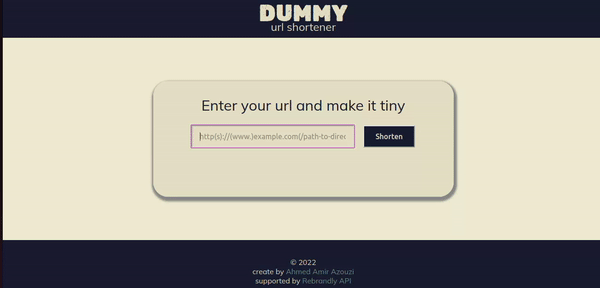

### Project's Title
vanillaJS-link-shortener

### Project's Description
a vanilla JS web app with minimal design and basic features (shorten url and copy to clipbord). The main purpose behind the app was to practice web development using the most basic tools (JS/HTML/CSS).

### Live Demo Link

### Tech Stack
- Javascript
- HTML
- CSS

### APIs
- Rebrandly API //for link shortening functionality
- ClipBoardJS //for copying links to clipboard

### Main Features
- Shorten link upon the "Shorten" button click event 
- Automatically copy the generated link to the clipboard upon the "Copy" button click event.
- Form Control: display success/error messages upon form submission
- Responsive design accross different screen sizes
